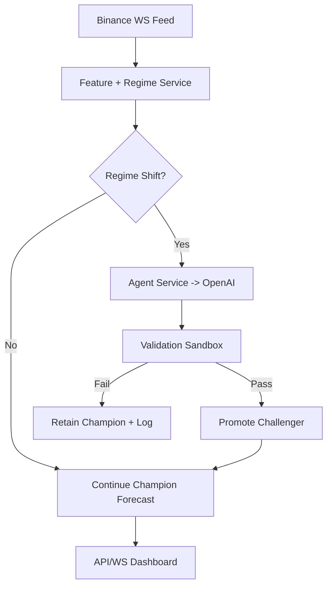

# App Flow Document: Dynamic Volatility Regime Modeler (Revamp 2026)

## 1. Primary Loop
`Monitor -> Detect -> Synthesize -> Validate -> Promote -> Observe`

## 2. System Flow
1. Ingest-service consumes Binance stream and writes ticks/order-book snapshots.
2. Regime-service computes rolling features and updates `live_features`.
3. Shift detector evaluates posterior sequence and emits `REGIME_SHIFT_DETECTED`.
4. Agent-service assembles context package and calls OpenAI to generate candidate model code.
5. Validation-service runs static/runtime checks and walk-forward benchmark.
6. If pass + threshold, promote and update active model pointer.
7. API-gateway streams updated forecast + deployment event to dashboard.

## 3. Human-in-the-Loop Modes
- `auto`: system deploys automatically on passing thresholds.
- `semi-auto`: user approves promotion.
- `manual-lock`: prevent changes for selected assets/time windows.

## 4. Failure Handling
- LLM invalid code: self-correct loop max 3 attempts.
- Validation fail: keep champion, log rejection reason.
- Feed disconnect: REST polling fallback + stale-feed alert.
- Sandbox timeout: kill container, mark generation failed.

## 5. Event Types
- `REGIME_SHIFT_DETECTED`
- `MODEL_GENERATION_STARTED`
- `MODEL_GENERATION_FAILED`
- `MODEL_VALIDATION_PASSED`
- `MODEL_VALIDATION_FAILED`
- `MODEL_PROMOTED`
- `MODEL_LOCKED`

## 6. Text Diagram

