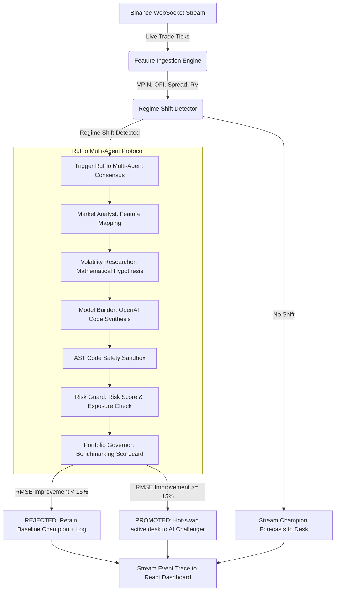

# PRODUCT BRIEF: VITTAM 2.0
## 🚀 One-Pager Investor Pitch & Product Brief
**Outskill x OpenAI Builders Hackathon — Milestone 1 (Wednesday Checkpoint)**

---

### 1. The Pain Point (The Problem)
Quantitative hedge funds and algorithmic trading systems lose billions of dollars annually due to **alpha decay** and **sudden volatility regime shifts** (e.g., flash crashes, sudden liquidity evaporation). 
- Traditional econometric forecasting models (like GARCH, EWMA, or HAR-RV) are **static**. They fail spectacularly during structural breaks because their mathematical assumptions are hardcoded.
- Refitting these models is a manual, labor-intensive **Quant Research Workflow** that takes quantitative researchers days or weeks of backtesting and validation — during which funds remain highly exposed or are forced to halt trading.

### 2. The Solution: VITTAM 2.0
VITTAM 2.0 is an **agentic, AI-driven volatility forecasting engine** that autonomously rewrites its own forecasting logic in real-time when the market shifts. It automates the entire Quantitative Research cycle from seconds to milliseconds:
1. **Real-time Detection**: Continuous Hidden Markov Models monitor high-frequency microstructure indicators (VPIN, Order Flow Imbalance, realized volatility) directly from live exchange feeds (Binance).
2. **Agentic Synthesis**: The moment a regime shift (stable ➔ trending ➔ panic) is detected, a **Multi-Agent Consensus Protocol (RuFlo)** initiates. The **Model Builder** agent uses `gpt-4o` to formulate a mathematical hypothesis (e.g., fractional Brownian motion, autoregressive continuity) and synthesize custom, executable Python code.
3. **Rigorous Sandboxing**: Generated code is parsed into Abstract Syntax Trees (AST) to strip unsafe operations, block imports, and prevent non-deterministic code.
4. **Walk-Forward Validation**: The model is benchmarked in a safe execution sandbox against live tick data and baseline champion models. If it improves forecast RMSE by $\ge 15\%$, it is **auto-promoted** to production without interrupting the live data stream.

---

### 3. Target Market & Audience
- **Market Makers & Liquidity Providers**: Who need real-time volatility tracking to tighten bid-ask spreads safely.
- **Systemic Crypto Hedge Funds**: Who require automated risk-management adjustments during flash crashes.
- **Quant Developers**: Who want to automate the research pipeline and eliminate manual parameter refitting.

---

### 4. Technical Architecture
VITTAM 2.0 is built on a high-throughput, low-latency stack designed for developer-first observability:
- **Backend Core**: Python 3.12, FastAPI, WebSockets, NumPy, and PyTest (100% test coverage with 21/21 passing unit/integration tests).
- **Agent Orchestrator**: "RuFlo" Multi-Agent Engine containing 5 specialized, memory-sharing agents:
  - `market_analyst`: Ingests ticks and builds statistical microstructural vectors.
  - `volatility_researcher`: Evaluates regimes and defines mathematical constraints.
  - `model_builder`: Synthesizes code via OpenAI Codex/gpt-4o and runs AST validation.
  - `risk_guard`: Formulates risk limits and prevents over-leverage.
  - `portfolio_governor`: Conducts backtests and publishes "Regime Shift Briefings."
- **Premium User Experience**: Responsive, glassmorphic Vite/React 19 control room dashboard utilizing Tailwind CSS v4, Lucide React, and Recharts. Exposes the real-time double-axis chart, side-by-side IDE view (Champion vs. AI Challenger), validation scorecard, and real-time orchestrator terminal traces.

---

### 5. Why VITTAM 2.0 Will Win
- **Technically Credible**: Complete pipeline functional locally. Zero reliance on fake or hardcoded mock loops; the agent compiles and tests real executable code at runtime.
- **High Utility**: Shrinks the algorithmic adaptation feedback loop from 2 weeks to under 90 seconds.
- **Extreme Originality**: Instead of typical chatbot summaries, it uses multi-agent consensus to construct verifiable software in a sandbox, deploying it safely.

---

### 6. Dynamic User Flow Diagram

