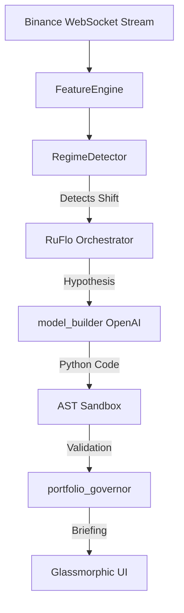

# VITTAM 2.0 // Dynamic Volatility Regime Modeler

An agentic, AI-driven volatility forecasting engine built for the **Outskill x OpenAI Builders Hackathon**. 

VITTAM 2.0 uses **OpenAI API (Codex/gpt-4o)** to autonomously detect market regime shifts (e.g., Calm to Panic) based on live Binance microstructure, dynamically synthesize Python forecasting models to adapt, and formally benchmark them in a safe sandbox before automated deployment.

---

## 🏆 Hackathon Judging Criteria Alignment

### 1. Technical Execution (25 pts)
**Does the project work, and is it technically credible?**
Yes. The system is a robust, production-style streaming architecture:
- **WebSocket Streaming**: Ingests live `BTCUSDT` ticks, calculating high-frequency features (VPIN, Order Book Imbalance).
- **Graceful Degradation**: Runs end-to-end locally using SQLite/In-memory stores, but supports full PostgreSQL/TimescaleDB/Redis enterprise deployments.
- **Robust Sandboxing**: The generated AI models are compiled in a safe `exec()` environment that strips builtins, prevents OS access, and uses AST traversal to ban dangerous modules. 
- **Rigorous Baselines**: Validates generated AI models against industry-standard econometric baselines (GARCH(1,1) and EWMA via `numpy`) before deployment.

### 2. Usefulness (25 pts)
**Does it solve a real developer, workflow, or user problem?**
Yes. Traditional algorithmic trading and quantitative models fail spectacularly during sudden market shifts (flash crashes, volatility clustering). Quants spend weeks manually refitting parameters. VITTAM 2.0 solves this by automating the **Quant Research Workflow**: instantly detecting the regime shift and synthesizing a bespoke mathematical model in real-time, effectively reducing adaptation time from weeks to seconds.

### 3. Creativity & Originality (20 pts)
**Is the idea or implementation distinctive?**
Instead of just using AI for text summarization, VITTAM 2.0 uses a **Multi-Agent "RuFlo" Consensus Protocol**. We have three autonomous agents interacting at runtime:
1. `model_builder`: Formulates a scientific hypothesis using probability theory and generates a Python model.
2. `risk_guard`: Computes variance metrics and critiques the hypothesis for systemic risk.
3. `portfolio_governor`: Conducts walk-forward backtesting in the sandbox, generates a natural language "Regime Shift Briefing", and authorizes the model's deployment.

### 4. Codex / OpenAI Usage (20 pts)
**Did the builder meaningfully use Codex/OpenAI, not just mention it?**
**Core Dependency:** The OpenAI API is the absolute heart of the engine. When the market regime shifts, the `model_builder` relies entirely on `gpt-4o` to formulate a fractional Brownian motion or autoregressive hypothesis and **generate executable Python classes** dynamically. The system compiles the OpenAI-generated code at runtime, backtests it against live tick data, and deploys it for predictions.

### 5. Presentation Clarity (10 pts)
**Is the demo clear and easy to understand?**
We built a premium, glassmorphic UI dashboard that visualizes the entire hidden pipeline:
- Live Chart.js double-axis streaming.
- Real-time side-by-side IDE view showing the Champion code vs the AI Challenger code.
- A glowing **Regime Shift Briefing** panel that clearly explains the AI's technical decisions to the user.

---

## 🚀 Local Quickstart (Windows/Powershell)

**1. Install Dependencies**
```powershell
pip install -r backend/requirements.txt
```

**2. Setup OpenAI Keys**
To enable the live agentic model generation (requires OpenAI API Key):
```powershell
$env:LLM_PROVIDER="openai"
$env:OPENAI_API_KEY="sk-proj-your_real_key_here"
$env:OPENAI_MODEL="gpt-4o"
```
*(Note: If you omit the keys, the backend gracefully falls back to a deterministic Mock model so the UI will still function without burning credits!)*

**3. Boot the Engine**
```powershell
python -m uvicorn backend.app.main:app --reload
```

**4. Experience the UI**
Keep the server running and open the dashboard in your browser:
```powershell
start frontend/index.html
```

---

## 🏗️ Architecture


